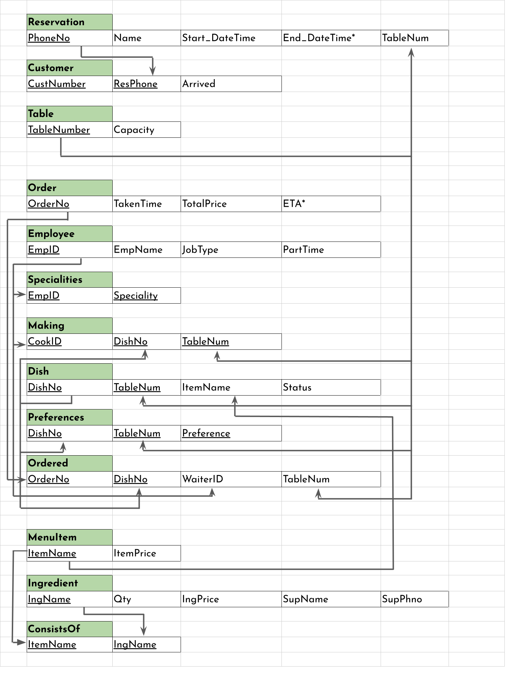

\captionsetup[figure]{labelformat=empty}
\pagestyle{empty}

# Relational Model
The ER model was converted to a relational model following the given procedure.  

The employee $\to \{\text{waiter}, \text{cook}, \text{cashier}, \dots \}$ specialisation was represented using an attribute in the EMPLOYEE table, named JobType, which can take values like "Waiter", "Cook", etc. Note that the PartTime attribute applies only to waiters and is therefore NULL for all other types of employees.  

The underlined attributes *together* form a composite key. A star indicates a derived attribute. Candidate keys are unmarked. Arrows go from the primary key to the foreign keys.

