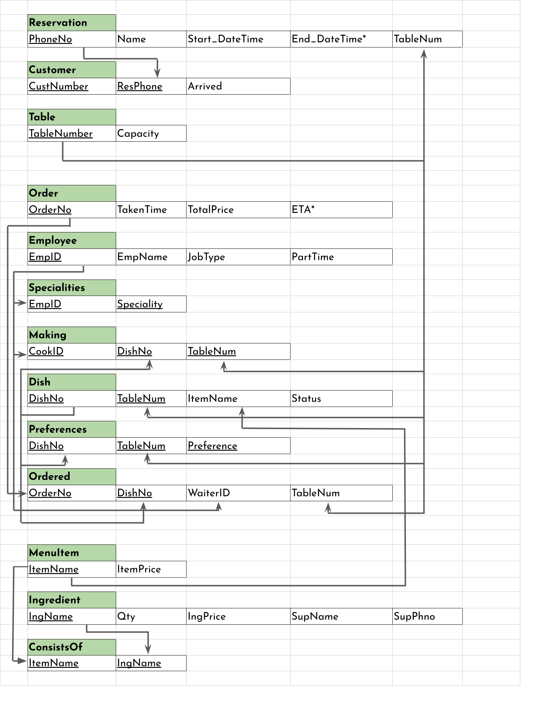

\captionsetup[figure]{labelformat=empty}
\pagestyle{empty}

# First Normal Form
No changes were made to convert the model to first normal form. All the data values are atomic as the multivalued attributes (specialities, preferences) were represented as separate relations.

