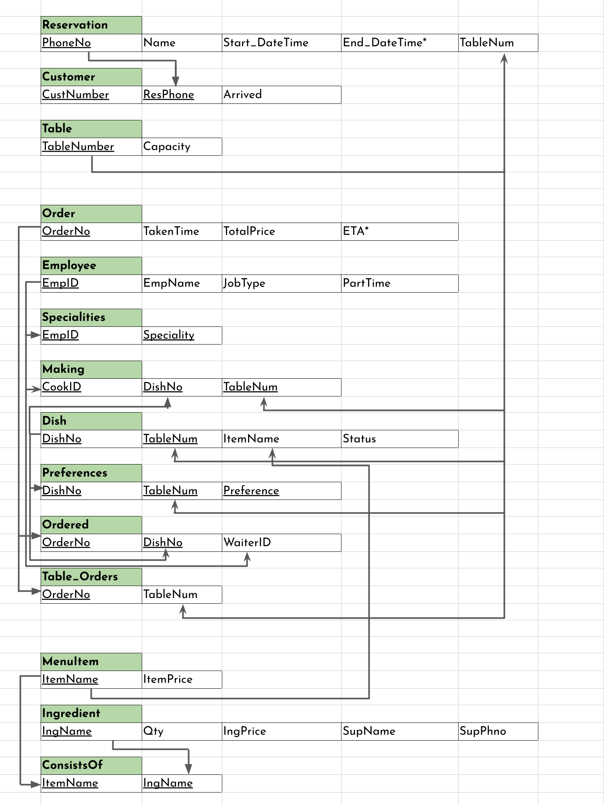

\captionsetup[figure]{labelformat=empty}
\pagestyle{empty}

# Second Normal Form
The second normal form requires that no non-prime attribute is dependent on a subset of the primary key. Most tables either have a singleton primary key or have no non-prime attributes, and therefore satisfy this normal form.  

The only table that needs to be decomposed is ORDERED, in which the dependency OrderNo $\to$ TableNum exists (the key is $\langle$OrderNo, DishNo$\rangle$).  
To solve this, TableNum is removed from ORDERED and a new relation, TABLE_ORDERS, is created. This relation has as its key OrderNo and another attribute, *i.e.*, TableNum. Both these two new tables satisfy 2NF.

