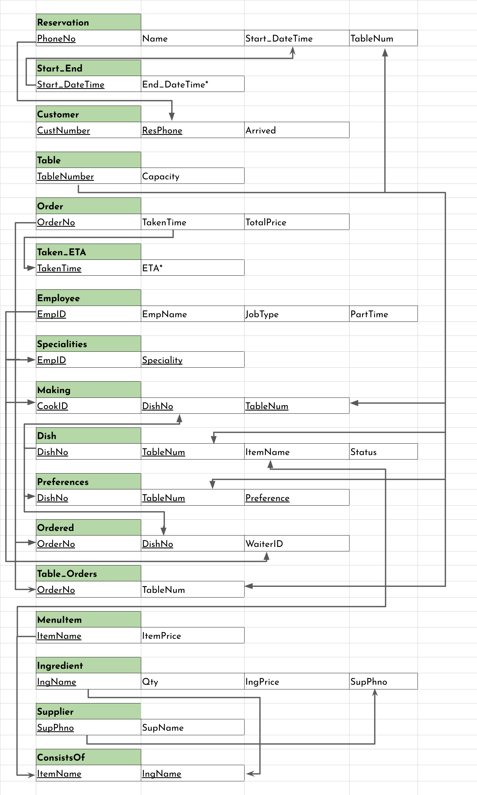

\captionsetup[figure]{labelformat=empty}
\pagestyle{empty}

# Third Normal Form
The third normal form requires that all functional dependencies either have a superkey on the LHS, or a non-prime attribute on the RHS, *i.e.*, there are no dependencies from one non-prime attribute to another.  

This is satisfied by all tables in which either there are no non-prime attributes, or there is only one. Among the other relations, three need to be decomposed.  

In RESERVATION, End_DateTime is derived from Start_DateTime, which makes a functional dependency which does not satisfy 3NF. This is fixed by removing End_DatTime from RESERVATION and adding it as an attribute (with Start_DateTime as key) to a new relation, START_END.  

Similarly, in ORDER, ETA is derived from TakenTime. This is solved analogously; ETA is removed from ORDER and added, with TakenTime as key, to a new relation named Taken_ETA.  

In INGREDIENT, all suppliers have a unique phone number. Therefore we have the dependency SupPhno $\to$ SupName. This does not satisfy 3NF; we therefore create a new table, SUPPLIER, with SupPhno as key and SupName as an attribute, removing the latter from INGREDIENT.  

These three changes satisfy the third normal form for the table.

