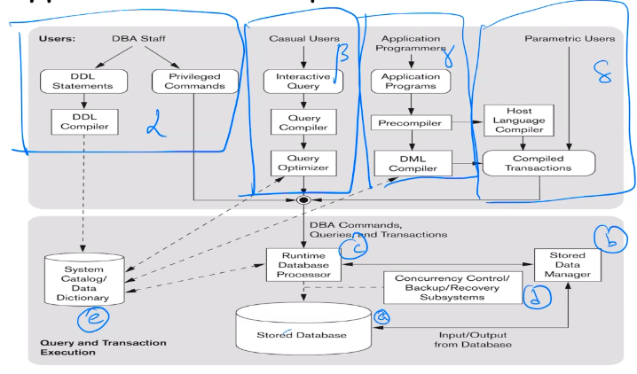
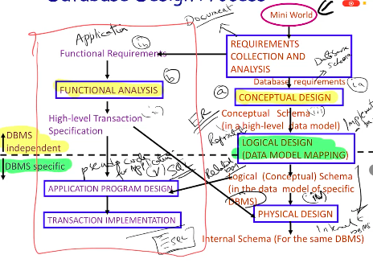

# About DBMSs
## Levels (contd.)
Most databases have what is known as a _three-schema architecture_, which consists of three levels – external (applications that query the database), conceptual (independent of the DBMS) and internal (implementation and storage).  

The three-schema architecture has been proposed to support program-data independence and multiple views of the data. It is not widely used in commercial database.  

* The internal schema describes physical storage structures and access paths (like indices). It uses a physical data model.
* The conceptual schema describes the structure and constraints for the whole database. It uses a conceptual or implementational data model.
* The external schema describes various users' view of the data. It uses the same data model as the conceptual schema.

Programs refer to an external schema and are mapped to the internal schema by the DBMS. After extraction, it is reformatted to match the user's external view.

## Data Independence
Data independence is of two kinds:
* Logical data independence is the capacity to change the conceptual schema without having to change the external schemata or their associated programs.
* Physical data independence is the capacity to change the internal schema without having to change the conceptual schema.

When a lower-level schema is changed, therefore, only the mappings between this schema and higher-level schemas need to be changed (if the DBMS fully supports data independence). The higher-level schemata are themselves unaltered.

# Entity-Relationship (ER) Data Model
An ER data model is essentially a conceptual (close to the users) model.  

## Database Design Process
First, a *miniworld* is given, which includes all the relationships and objects that need to be stored in the database (and possibly some extraneous data). We study the miniworld and identify the data requirements and possible applications – this gives us *functional requirements* (applications) and *database requirements* (the database schema).  

Next, through functional analysis and conceptual design, we obtain the high-level transactions and the conceptual schema (a high-level data model) from each of the sets of requirements.  

The application program can then be designed (pseudocode can be written), and data model mapping gives us the logical schema (an implementation-level data model) for a specific DBMS.  

Finally, the internal schema and the transaction implementation (actual code) can be designed.

## Entities and Attributes
*Entities* are specific objects in the miniworld that are represented in the database. *Attributes* are properties or characteristics of entities.  

Entities with the same set of attributes are grouped together into *entity types*.  

An attribute of which all entities must have a unique value is called a *key attribute*. An attribute can be *simple* (containing atomic values) or *composite* (having many parts). They can also be *multivalued* (having more than one value at a time) or *derived* (dependent on the value of some other attribute).
