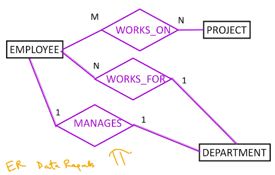

# Entity-Relationship (ER) Data Model
## Visualising of Structural Constraints
We can represent the structure of an ER database in diagrammatic form.  

Rectangles represent entity types.  
Ovals represent attributes.  
Parallelograms represent relationships.  
Numbers on the lines connecting the entity types with the relationships represent the cardinality ratio.  

A double line between an entity type and a relationship indicates total participation.  

It is also possible to define the minimum and maximum number of entities that can be related to one entity, for each relationship. In this case, the pair (min, max) is written on the line between the entity type and relationship.

## Relationships as Attributes
A $1:1$ relationship can be replaced by a single-valued attribute in any of the participating entity types.  

A $1:n$ relationship can be replaced by a single-valued attribute on the $n$ side entity type, and a multi-valued attribute on the 1 side entity type.  

A $m:n$ relationship needs a multi-valued attribute on the entity types of both sides.

## Entity Types
An entity type is defined by the set of attributes. It is a set of entities, all of which have the same set of attributes.  

A weak entity type is one which does not have a *key* attribute. Entities belonging to weak entity types cannot be uniquely determined by their own attributes; they are identified by a partial key (one of their own attributes) and the entity they are related to in the identifying entity type.  
A weak entity type is represented by a double box and the identifying relationship by a double parallelogram.

## $n$-ary Relationship Types
A relationship among $n$ entity types is an $n$-ary relationship. It can be modelled by $n$ binary relationships.  

For example, a ternary relationship $T$ can be modelled by 3 binary relationships $B_1, B_2, B_3$ by letting $$(a, b) \in B_1, (b, c) \in B_2, (c, a) \in B_3 \iff (a, b, c) \in T.$$
